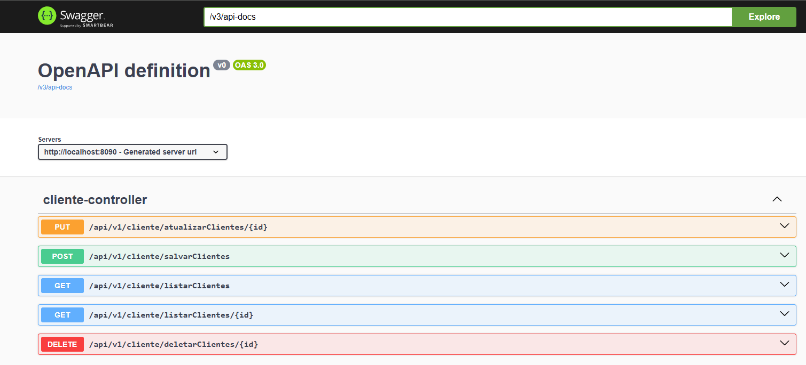

## 🧪 Tecnologias e ferramentas utilizadas

- 🐘 H2
- ☕ Spring Boot
- 📦 ViaCep

---

## Como foi feito esse projeto?
📍 Esse projeto foi Desenvolvido utilizando a tecnologia Spring Boot. A ideia do projeto
é a construção de uma API REST que seja capaz de realizar INSERÇÃO, CADASTRO, ATUALIZAÇÃO, DELETAR
dados. Além disso, ao cadastrarmos um cliente podemos realizar através da Interface Feign do Spring consultar uma API externa que é a ViaCep.

  <strong>🌍 Feito  ❤️ in Rio de Janeiro, Brazil 🇧🇷</strong>

